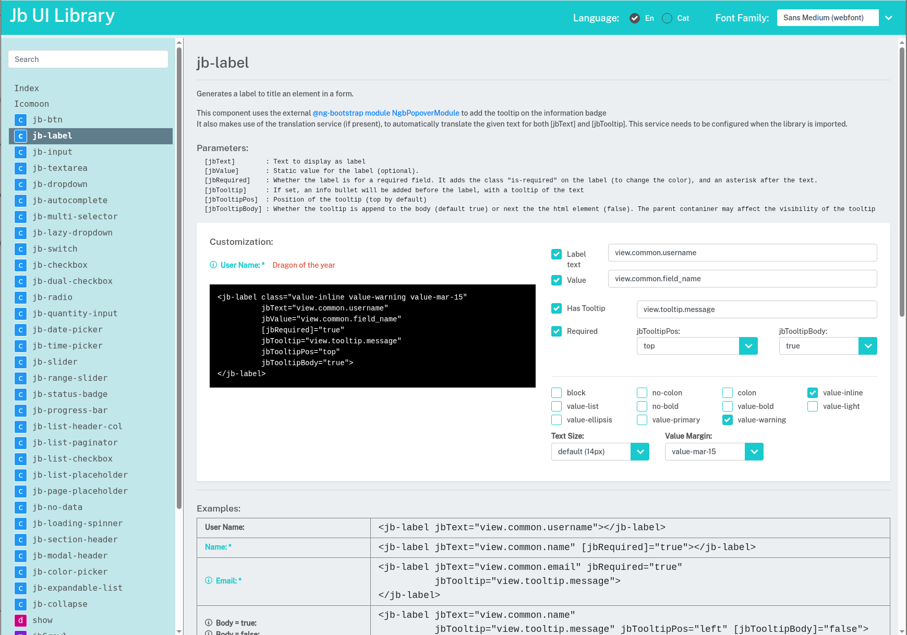

# Jb UI Library
Angular based component library

This library contains a set of Angular basic components to build applications, such as **buttons**, **inputs**, **dropdowns**, **checkboxes**, **sliders**, **switches**, **date** and **time pickers**, **list elements**, etc.<br/>
It also exports some other generic elements, such as list handlers, services, modules and directives.



## Documentation
A separate repository with an interactive app to sandbox and test the library is used. You can use it as an reference.<br/>

Accessible on: https://jb-ui-lib-doc.netlify.app

## How to install the library
There are 2 options, pulling the library from the public NPM repository (simple) or reference the local file system

- Install from NPM: `npm install jb-ui-lib --save`

- Install from file reference: `npm install ../../../jb-ui-lib/dist/jb-ui-lib/jb-ui-lib-*.*.*.tgz --save`

### Dependencies

This library has some dependencies. It works with <a href="https://getbootstrap.com">Bootstrap</a> and <a href="https://ng-bootstrap.github.io/">Angular Bootstrap</a>, so you'll have to install them to get everything working.
It also uses the icon library <a href="https://icomoon.io/">icoMoon</a>, which can easily be imported via npm: jb-icomoon
Remember also that many components of the library make use of the ngModel and it's formControl directive, so you'll need to import the **"FormsModule"** into your app's module.

```
npm i jb-ui-lib@0.4.9
npm i jb-icomoon@1.0.3
npm i bootstrap@4.4.1
npm i @ng-bootstrap/ng-bootstrap@5.1.5

-- For Angular >= 9, you also need:
ng add @angular/localize
```

The library also requires a translation service to be injected (`JbTranslateService`). There is an abstract class (`AbstractTranslateService`) you can extend to provide the methods for such service.

```typescript
import { FormsModule } from "@angular/forms";
import { JbUiLibModule } from "jb-ui-lib";

@Injectable({ providedIn: 'root' })
export class JbTranslateService {
  public onLangChange$ = new BehaviorSubject({lang: '', translations: []});
  public doTranslate = (label ?: string, params?): string => label;
  public getLabel$ = (label ?: string, params?) => of(label);
}

@NgModule({
  declarations: [AppComponent],
  imports: [
    BrowserModule,
    FormsModule,
    JbUiLibModule.forRoot({ trans: {
        useExisting: JbTranslateService
      }
    }),
  ],
  providers: [],
  bootstrap: [AppComponent]
})
export class AppModule { }
```

## Color Styling
The library exposes (without encapsulation) the css styles, so they can be overridden later.<br/>
A group of SCSS variables can be configured in order to change the colors or styles at convenience. Default values are provided based on the primary colors

Example:
```typescript
@import "scss/variables.scss";
@import '~jb-ui-lib/scss/index';
@import "~jb-icomoon/css/icomoon-free.css";
@import "~bootstrap/scss/bootstrap.scss";
```

## How to add a new component
The easiest way is by running the script `sh new_comp.sh`

To add a new component to the library (manually), follow the steps:

1. Create the component: `ng generate component myNewBaby --project=jb-ui-lib`
2. Export the component from the library module (_jb-ui-lib.module.ts_): `exports: [ … , MyNewBaby ]`
3. Export the component reference in _public_api.ts_ : `export * from './lib/my-new-baby/my-new-baby.component';`

4. Create a sandbox component to test and document it: `ng generate component myNewBabyDemo --project=jb-ui-lib-sandbox`
5. Add the new component to the list of `compList[]`, to register it into the sandbox app (_lib-register.service.ts_)
6. You can use the templates for the `myNewBabyDemo` component (_demo-comp.html.template_ and _demo-comp.ts.template_).<br/>
It is necessary that MyNewBabyDemo.component exports also an object with the "name, desc, api, instance, COMPONENT"


## How to update the library

To update the library and use it with a file reference, run the npm command (on root foolder): `npm run pack_all`

To update and publish the library (NPM repository), run script `sh publish.sh`
or do it manually following the steps:

1. Increment version: `npm run version_up`
2. Generate library: `npm run pack_all`
3. Login into NPM register (as joel.barba) `npm login`
4. Publish the library (*.*.* = current version) `npm publish ./jb-ui-lib/dist/jb-ui-lib/jb-ui-lib-*.*.*.tgz`<br/>

If you need to increment a minor or major version, replace point 1 by: `cd dist/jb-ui-lib && npm version patch | minor | major`

The library is published in the public NPM repository https://www.npmjs.com/package/jb-ui-lib.

[NPM documentation](https://docs.npmjs.com/packages-and-modules/)


## Further help
You can leave some comments on the project or contact [me](mailto:joel.barba.vidal@gmail.com) directly for more information.